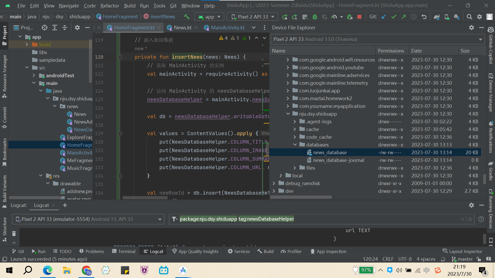

# FinalProject

## Author

NJU 丁晟元

## Introduction

十度App，简简简简简简易版百度App

## Progress

导航栏，以及跳转

数据库

泪目，终于成功了

完成news的cycleView

搜索栏

**天气**

**视频播放**

**音乐播放**

**个人中心+登录注册**

**上传图片**

## 使用说明

### 数据库相关

默认是没注释掉的，如果发现没数据，可以检查下下述位置

新闻数据使用了数据库，所以使用前应该先加数据，可将`java/nju/dsy/shiduapp/HomeFragment.kt`中的这段代码注释掉，从而添加数据：

### 天气相关

目前使用的还是死的数据

可考虑调用和风天气api，加入输入城市获取数据的效果

天气api调用：

[Android 天气APP（三）访问天气API与数据请求_android 天气api_初学者-Study的博客-CSDN博客](https://blog.csdn.net/qq_38436214/article/details/105328657)

获取定位信息：

[Android 天气APP（二）获取定位信息_setneednewversionrgc_初学者-Study的博客-CSDN博客](https://blog.csdn.net/qq_38436214/article/details/105328603)
