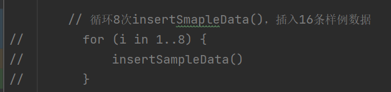

# FinalProject-ShiduApp

## 作者

NJU 丁晟元

QQ：1163413566（奔跑的淡水鱼）

Phone：13921306984

## 项目名

十度App，简简简简简简易版百度App

## 项目地址

gitee:https://gitee.com/shengyuand/finalproject
github:https://github.com/SYuan03/ShiduApp

## 使用说明

### 数据库相关

默认是没注释掉的，如果发现没数据，可以检查下下述位置

新闻数据使用了数据库，所以使用前应该先加数据，可将`java/nju/dsy/shiduapp/HomeFragment.kt`中的这段代码注释掉，从而添加数据：

 

### 天气相关

目前使用的还是死的数据

可考虑调用和风天气api，加入输入城市获取数据的效果

天气api调用：

[Android 天气APP（三）访问天气API与数据请求_android 天气api_初学者-Study的博客-CSDN博客](https://blog.csdn.net/qq_38436214/article/details/105328657)

获取定位信息：

[Android 天气APP（二）获取定位信息_setneednewversionrgc_初学者-Study的博客-CSDN博客](https://blog.csdn.net/qq_38436214/article/details/105328603)

## 亮点介绍

1. 尝试了多种数据存储方式，既有数据库，也有云存储，也使用了SharedPreferences
2. 界面简洁，色调和谐温暖（咳咳，迈阿密国际足球俱乐部限定配色主题）
3. 基本功能完善
4. 新增音乐播放界面，并且设置了可以无限滚动
5. 设置了登录注册功能
6. 可拓展性强，数据改动简单

## 项目演示

见同级目录下DemoVideo文件夹

## 遗憾

比较遗憾的是，由于自身原因没能规划好时间，导致30号才看完视频开始写

😭😭😭
